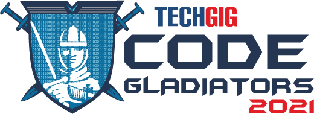

#

<!-- PROJECT LOGO -->
<br />
<p align="center">
  <a href="https://github.com/lakshyads/bosch-ai-hackathon-2021-kanthabai">
    
  </a>
  <a href="https://www.techgig.com/codegladiators/bosch-ai-hackathon">
    
  </a>

  <h3 align="center">Bosch AI Hackathon 2021</h3>

  <p align="center">
    Prototyping an AI model for automated home cleaning robot
    <br />
    <span style="color:red;font-size:22px"><strong>Team KanthabAI</strong></span>
    <br />
    <br />
    <a href="https://github.com/lakshyads/bosch-ai-hackathon-2021-kanthabai">View Code</a>
    <br />
    <a href="https://colab.research.google.com/github/lakshyads/bosch-ai-hackathon-2021-kanthabai/blob/master/RUN-WORKFLOW-HACKATHON.ipynb"></a>
    <!-- ·
    <a href="https://github.com/othneildrew/Best-README-Template/issues">Report Bug</a>
    ·
    <a href="https://github.com/othneildrew/Best-README-Template/issues">Request Feature</a> -->
  </p>
</p>

<!-- TABLE OF CONTENTS -->
<details open="open">
  <summary>Table of Contents</summary>
  <ol>
    <li>
      <a href="#about-the-hackathon">About The Hackathon</a>
      <ul>
        <li><a href="#problem-statement">Problem statement</a></li>
      </ul>
    </li>
    <li>
      <a href="#our-solution">Our solution</a>
      <ul>
        <li><a href="#pre-requisites">Prerequisites</a></li>
        <li><a href="#dataset">Dataset</a></li>
        <li><a href="#training">Our Training</a></li>
      </ul>
    </li>
    <li><a href="#usage">Usage</a>
    <ul>
        <li><a href="#initial-config">Initial Configuration</a></li>
        <li><a href="#detect">Detect</a></li>
      </ul>
    </li>
    <li><a href="#contributing">Contributing</a></li>
    <li><a href="#team">Team On LinkedIn</a></li>
    <li><a href="#acknowledgements">Acknowledgements</a></li>
  </ol>
</details>

---

<!-- ABOUT THE hackathon -->

## **About The Hackathon**

“Robert Bosch Engineering and Business Solutions” (RBEI) on its mission to be a preferred AIoT partner across industries, created a new Business Unit, Software and Digital Solutions (SDS) to focus on delivering software and digital services in the areas of digital enterprise, engineering R&D, new age technologies.
As SDS builds the ‘Enterprises of the Future’ and ‘Products of the Future’ , it uses advance technologies to make products connected, providing real time feedback and an immersive customer experience linking the customers and partners and providing transparency across the ecosystem. **The Robotic Technological Unit of SDS is at the forefront of this mission that uses Artificial Intelligence in ways never tested before.**

<!-- Problem statement -->

### **Problem Statement**

The **Robotic Technology Unit** of RBEI works on pre-development activities and robotic function developments for robots to be used in residential environment. We are currently in the process of prototyping an automated home cleaning robot to be used for domestic purposes. The AI model developed or an existing Pre-trained model should be capable of negotiating obstacles that includes following objects with cleaning robots Point Of View (POV).

This section should list any major frameworks that you built your project using. Leave any add-ons/plugins for the acknowledgements section. Here are a few examples.

- Furniture (especially Legs/poles). Example: Chair, Tables, Sofa
- Doors
- Cables/ wires lying around
- Socks/ small garments

The data used for training has to be captured and labeled by the participant.

No open source images to be used if used it should be disclosed.

More information on the problem statement can be accessed once you clear the screening round.

Grab this opportunity to experience working for a futuristic project and get a chance to be part of the team that implements it.

---

<!-- Our solution -->

## **Our Solution**

To find the best possible soltion to this problem, We tried out various object detection models. We tried out 2 stage detectors such as RCNN family and We tried our single stage detectors such as YOLO family.

We finally settled onto YOLOv5-large model due to its fast training speed and good accuracies.

<!-- pre-requisite -->

### **Prerequisites**

We choose the YOLOv5 PyTorch implementation and trained it for our custom dataset.  
Hence, this solutions makes use of and required prerequisite knowledge of

- Python
- PyTorch
- Using Google Collaboratory

<!-- dataset -->

### **Dataset**

We created mulitple videos from different household containing objects from any/all of the mentioned categories.

The next step was to extract images from these videos and annotate them.
For annotation, we used [CVAT](https://github.com/openvinotoolkit/cvat), which is a free, online, interactive video and image annotation tool for computer vision.

<!-- training -->

### **Our Training**

The next step was to train our model for our dataset.  
We tried various approaches to obtain the best possible accuracy:

- Trained the dataset on model initialized with random weights
- Trained the model initialized with pre-trained COCO weights
- Cleaned and corrected our data and annotations
- Increased the size of our training data
- Increased the variety of data used
- Used more data captured in various light conditions and at different angles

---

<!-- usage -->

## **Usage**

For easy usage, this repo includes [RUN-WORKFLOW-HACKATHON.ipnyb][run-workflow] which is a Jupyter Notebook and runs best in GoogleCollab.

Load directly in Google Collab <a href="https://colab.research.google.com/github/lakshyads/bosch-ai-hackathon-2021-kanthabai/blob/master/RUN-WORKFLOW-HACKATHON.ipynb"></a>

---

<!-- initial-config -->

### **Initial Configuration**

1. Load [RUN-WORKFLOW-HACKATHON.ipnyb][run-workflow] in Google Collab <a href="https://colab.research.google.com/github/lakshyads/bosch-ai-hackathon-2021-kanthabai/blob/master/RUN-WORKFLOW-HACKATHON.ipynb"></a>
2. Initialize the configuration variables in the `Initial Configuration` cell

   ```python
   selected_model = available_models[7] # Edit this to change the selected model variant of Yolov5
   weights_path = 'yolov5l6.pt'
   epochs = 350
   batch_size = 30
   image_size = 420

    # Github pull repo and branch

    git_branch = 'master'
    git_token = input('Enter github access token to commit/push your training/test/validation runs back to the selected branch. Leave blank to omit : ')

    # Detecting on new images (set archive path if archived folder else set images path)

    detect_images_archive_path = ''
    detect_images_path = ''

    # Testing Or Detecting on images - set to 'latest' to use last trained weights or set custom path

    weights_path_for_testing_or_detecting = 'latest'
   ```

3. Run the `Setup Git & LFS for downloading repo & dataset & ready the model/env` cell.

---

<!-- detect -->

### **Detect**

1. Upload the zipped images archive to collab environment.
2. set the path to this archive in the Initial Configuration `detect_images_archive_path` variable
3. Run the `Extract new images from zipped upload` cell to extract the contents of the archive.
4. Run the `Update --weights with required weights path` cell. **This will automatically take the latest and best trained weights from this repo.**
5. The above step will also run the detect activity using

   ```bash
   !python detect.py --source $detect_images_path --weights $use_weights --img $image_size --save-txt --save-conf
   ```

---

## Contributing

Contributions are what make the open source community such an amazing place to be learn, inspire, and create. Any contributions you make are **greatly appreciated**.

1. Fork the Project
2. Create your Feature Branch

   ```bash
   git checkout -b feature/AmazingFeature
   ```

3. Commit your Changes

   ```bash
   git commit -m 'Add some AmazingFeature'
   ```

4. Push to the Branch

   ```bash
   git push origin feature/AmazingFeature
   ```

5. Open a Pull Request

---

<!-- team -->

## Team On LinkedIn

[![LinkedIn][linkedin-shield]][linkedin-url]

- [Lakshya Dev Singh](https://www.linkedin.com/in/lakshya-dev-singh/)
- [Sachin Bhardwaj](https://www.linkedin.com/in/sachin-bharadwaj-a3a825130/)
- [Sanjana Varaprasad](https://www.linkedin.com/in/sanjanavaraprasad/)
- [Abeesh Nair](https://www.linkedin.com/in/abheesh-nair/)
- [Shubham Dhole](https://www.linkedin.com/in/shubham-dhole-077b091b2/)

Project Link: [https://github.com/lakshyads/bosch-ai-hackathon-2021-kanthabai](https://github.com/lakshyads/bosch-ai-hackathon-2021-kanthabai)  
<a href="https://colab.research.google.com/github/lakshyads/bosch-ai-hackathon-2021-kanthabai/blob/master/RUN-WORKFLOW-HACKATHON.ipynb"></a>

<!-- ACKNOWLEDGEMENTS -->

## Acknowledgements

- [YoloV5 Official repo](https://github.com/ultralytics/yolov5)
- [CVAT](https://github.com/openvinotoolkit/cvat)
- [YOLO](https://pjreddie.com/darknet/yolo/)
- [BOSCH AI Hackathon](https://www.techgig.com/codegladiators/bosch-ai-hackathon)

<!-- MARKDOWN LINKS & IMAGES -->
<!-- https://www.markdownguide.org/basic-syntax/#reference-style-links -->

[linkedin-shield]: https://img.shields.io/badge/-LinkedIn-black.svg?style=for-the-badge&logo=linkedin&colorB=555
[linkedin-url]: https://www.linkedin.com/in/lakshya-dev-singh/
[product-screenshot]: images/screenshot.png
[run-workflow]: RUN-WORKFLOW-HACKATHON.ipynb
